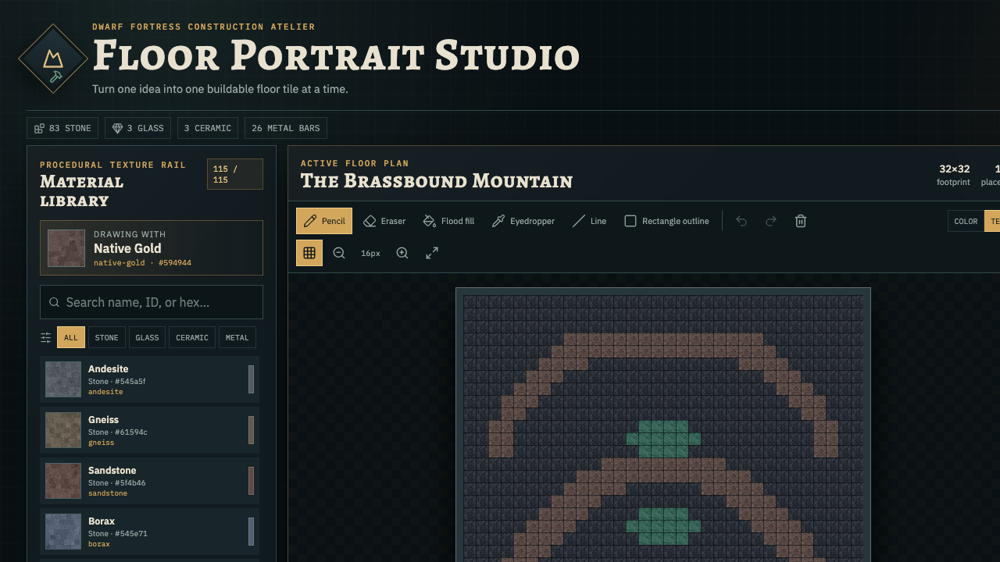
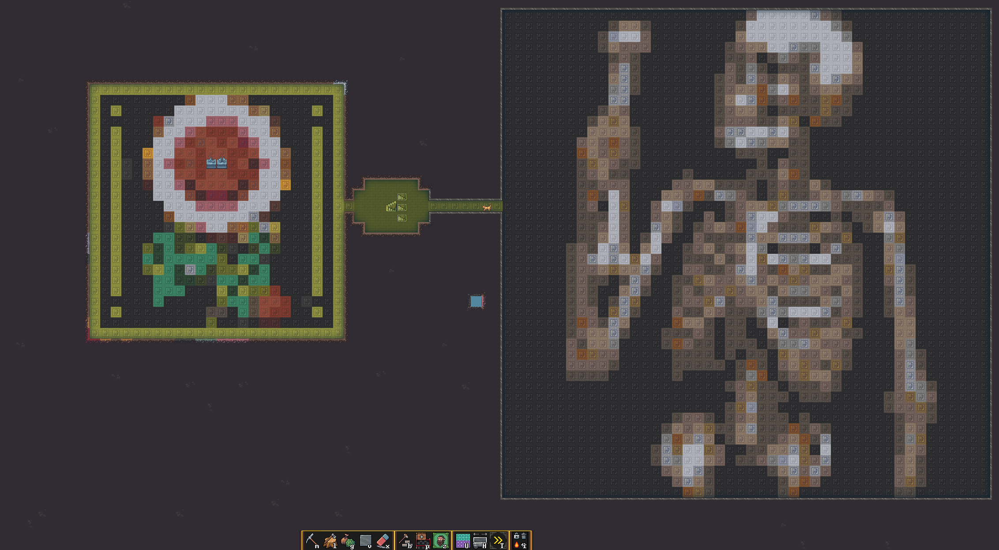

# Dwarf Fortress Floor Portrait Studio

A local-first pixel portrait planner for constructing floor art in **Dwarf Fortress**. One editor cell represents one constructed in-game floor tile.

> **Unofficial project:** This fan utility is not affiliated with or endorsed by Bay 12 Games, Kitfox Games, or DFHack. Project code and procedural textures are MIT-licensed; the illustrative in-game screenshot below contains third-party game content and is excluded from that license.



## In-game result



*Two large constructed-floor portraits shown in Dwarf Fortress. Screenshot provided by the project owner for illustrative use; Dwarf Fortress visuals and UI remain the property of their respective owners and are not covered by this repository's MIT License.*

## Features

- Portraits from 1×1 through 100×100 tiles.
- Pencil, eraser, flood fill, eyedropper, line, and rectangle tools.
- Undo/redo, zoom, fit-to-view, and grid controls.
- 115 named materials: 83 Stone, 3 Glass, 3 Ceramic, and 26 Metal.
- Deterministic original 48×48 procedural textures plus a clean color mode.
- Image import with contain-to-canvas mapping, palette restrictions, and optional Floyd–Steinberg dithering.
- Provider-neutral AI chatbot workflow using validated compact JSON runs.
- PNG, JSON, ordered CSV, build-run CSV, text-plan, and staged Quickfort downloads.
- Browser `localStorage` persistence with no account, API key, or cloud service.

## Requirements

- Node.js 22.12 or newer (`.nvmrc` pins the verified release runtime).
- npm 10 or newer.

## Run from source

```bash
git clone https://github.com/ElvisExMachina/dwarf-fortress-floor-portrait-studio.git
cd dwarf-fortress-floor-portrait-studio
npm ci
npm run dev
```

Open the local URL printed by Vite, normally <http://127.0.0.1:5173/>.

`npm run dev` regenerates the deterministic texture catalog before starting. A clean clone does not need a reference image or any private asset.

## Run the release build

Download the release ZIP and `SHA256SUMS`, verify the archive, and extract it. From the extracted application directory:

```bash
python3 -m http.server 8000
```

Then open <http://127.0.0.1:8000/>. The static build must be served over HTTP rather than opened directly as a `file://` URL.

The archive includes offline copies of the [AI chatbot workflow](docs/AI_CHATBOT.md), [Quickfort instructions](docs/QUICKFORT.md), verified JSON example, and the illustrative in-game screenshot.

## Editor workflow

1. Create or resize a portrait from 1×1 through 100×100.
2. Choose a background/eraser material.
3. Search or filter the material rail.
4. Draw with the toolbar or keyboard shortcuts: `P`, `E`, `F`, `I`, `L`, and `R`.
5. Use **Color** for planning or **Texture** for close inspection.
6. Export the finished plan in the format you need.

## Ask an AI chatbot for a design

The **AI Design Desk** works with any capable cloud or local chatbot that can follow detailed instructions and return strict JSON. It is a transparent copy/paste handoff—not a hidden API integration:

1. Enter an idea, dimensions, style notes, background, and optional material IDs.
2. Click **Copy AI chatbot request**.
3. Paste the complete request into the chatbot of your choice.
4. Copy its entire JSON-only response into **Chatbot design JSON**.
5. Click **Validate and import design**.
6. If validation fails, paste the exact Studio error back into the chatbot and ask for one corrected JSON object only.

The Studio sends nothing to an external service and stores no chatbot credentials. Your selected chatbot's privacy terms apply to anything you paste into it. The importer validates the complete design before changing the canvas; invalid dimensions, coordinates, lengths, backgrounds, or material IDs are rejected atomically.

For compatibility notes, local-model tips, troubleshooting, privacy guidance, and the complete workflow, see [`docs/AI_CHATBOT.md`](docs/AI_CHATBOT.md).

### Compact design schema

```json
{
  "version": 1,
  "name": "Gold Rune",
  "width": 8,
  "height": 8,
  "background": "obsidian",
  "runs": [
    { "y": 1, "x": 3, "length": 2, "material": "native-gold" },
    { "y": 6, "x": 3, "length": 2, "material": "malachite" }
  ]
}
```

Coordinates are zero-based. Runs are horizontal, may overlap, and use later-run-wins semantics. Cells omitted from `runs` use `background`. A verified fixture is included at `qa/qa-gold-rune.json`.

## Image import

**Import image** contains the source image inside the current canvas without cropping, then maps each pixel to the nearest selected material color.

Options:

- Floyd–Steinberg dithering.
- Restrict matching to the current search/category results.

Importing changes the tile grid without changing project dimensions.

## Downloads

- **PNG preview** — current Color or Texture mode with nearest-neighbor scaling.
- **Compact JSON** — re-importable project runs.
- **Ordered tile CSV** — every cell in row-major order.
- **Build-runs CSV** — contiguous horizontal material runs.
- **Build plan text** — totals and row-by-row instructions.
- **Staged Quickfort CSV** — a harmless README followed by one manual-filter build phase per material.

The ordered CSV columns are:

```text
order,row,column,x,y,material_id,material_name,category,color_hex
```

Human-facing `order`, `row`, and `column` values are 1-based. Automation-facing `x` and `y` values are zero-based.

## Quickfort material limitation

Quickfort's `Cf` token records **where to construct a floor**, not which material to use. Current DFHack therefore cannot encode a multicolor portrait as a one-click material-aware blueprint.

The staged export starts on `#notes label(README)`, which builds nothing. For every subsequent `filterNN_material_then_apply` section:

1. Set buildingplan's floor filter to only the exact named material.
2. If the material category is Metal, first run `buildingplan set bars true`.
3. Keep the Quickfort cursor on the same intended upper-left portrait tile.
4. Preview and apply that one phase.

Never apply a material section while the filter says `[any material]`. See [`docs/QUICKFORT.md`](docs/QUICKFORT.md) for complete instructions and specification links.

## Verification

```bash
npm run verify
npm audit --omit=dev --audit-level=high
npm run release:package
```

The release gate covers material counts and texture uniqueness, 100×100 allocation, drawing tools, history, compact JSON validation, quantization, CSV ordering and escaping, Quickfort phase semantics, TypeScript, ESLint, production build, dependency audit, release archive, and checksum.

## Project map

```text
.github/workflows/ci.yml       GitHub Actions release gate
scripts/material-palette.mjs   canonical IDs, names, categories, and planning colors
scripts/generate-materials.mjs deterministic original texture/catalog generator
scripts/package-release.sh     static release ZIP and SHA-256 checksum
public/materials/              generated procedural textures and catalog
src/data/                      generated typed catalog
src/lib/                       grid, runs, quantization, rendering, and exports
src/components/                editor and workflow panels
qa/                            fixed compact-design fixture
docs/AI_CHATBOT.md             provider-neutral chatbot workflow and troubleshooting
docs/QUICKFORT.md              staged Quickfort material-filter instructions
docs/images/                   illustrative in-game screenshot (third-party content)
docs/                          release and implementation documentation
```

## License

Original project code and procedural textures are available under the [MIT License](LICENSE). See [THIRD_PARTY_NOTICES.md](THIRD_PARTY_NOTICES.md) for non-affiliation, trademark, dependency, and compatibility notices, and [THIRD_PARTY_LICENSES.txt](THIRD_PARTY_LICENSES.txt) for complete bundled runtime license texts.
